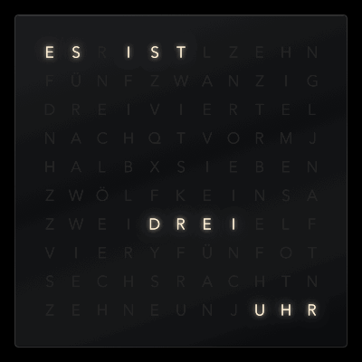

# Wortuhr – word clock screen saver for macOS

**English** · [Deutsch](README.de.md)

· **[Try it in the browser](https://diavolezza.github.io/wortuhr/)**
· **[Download](https://github.com/Diavolezza/wortuhr/releases/latest)**

A word clock on an 11×10 letter grid. The minutes between the five-minute steps light up the edges of the
plate one after the other – top, right, bottom, left – and go dark again with the next words. The latest edge
is the brightest; how much the earlier ones still glow (“afterglow”) is adjustable, from only the latest edge to all
equally bright.
The time is spelled out in eight variants:

| Language | Example (3:15 · 3:45) |
|---|---|
| German (standard) | viertel nach drei · viertel vor vier |
| Swiss German | viertel ab drü · viertel vor vieri (3:25 füf vor halbi vieri) |
| German (southern) | viertel vier · dreiviertel vier |
| English (British) | a quarter past three · a quarter to four |
| English (American) | a quarter after three · a quarter to four |
| French | trois heures et quart · quatre heures moins le quart (12:00 midi, 0:00 minuit) |
| Italian | le tre e un quarto · le quattro meno un quarto (1:00 è l’una) |
| Spanish | las tres y cuarto · las cuatro menos cuarto (1:00 es la una) |

Colours, typeface, size, the glow of the minute edges, burn-in protection and “main display only” can be set
in the options dialog; the dialog appears in the selected language. On first start the clock uses the Mac’s
language.

Tested on macOS 27 on Apple Silicon; built for Apple Silicon and Intel (macOS 13 or later).

## Download and install

Download `Wortuhr-….zip` from the [latest release](https://github.com/Diavolezza/wortuhr/releases/latest),
unzip it and move `Wortuhr.saver` to `~/Library/Screen Savers`. The bundle is signed ad hoc,
not notarised, so remove the download quarantine once in Terminal:

    xattr -dr com.apple.quarantine ~/Library/Screen\ Savers/Wortuhr.saver

Then select “Wortuhr” in System Settings → Screen Saver.

## Build and install from source

    ./build.sh --system

Requires Xcode (or the Command Line Tools). The script builds for Apple Silicon and Intel,
creates the thumbnail, signs ad hoc and installs to `/Library/Screen Savers`
(asks for the administrator password). Then click the “Wortuhr” tile once in System Settings.

System Settings shows the custom thumbnail only for savers in `/Library/Screen Savers`;
`./build.sh` without options installs to `~/Library/Screen Savers` (with the default swirl).

`--arm-only` builds for Apple Silicon only – faster, and enough for your own Mac
(e.g. `./build.sh --system --arm-only`). Build without it to share the saver.

`--docs` also renders the README images in `docs/` with the screen saver itself.

## When something goes wrong

    ./diag.sh

writes the system log (last 20 minutes) and crash reports to `diag.log`.

## macOS 26+ quirks the code works around

- The screen saver keeps running behind the login window → fade out on input.
- The login window disappears again after 30 s without input → then fade the clock back in.
- The preview in System Settings reports `isPreview = false` → input detection only for the real
  screen saver: after `didstart` or when the screen is locked (`CGSSessionScreenIsLocked`).
  The size is not an indicator either – the preview is screen-sized internally as well.
- `didstart` is unreliable: sometimes it never arrives, sometimes it arrives before macOS creates
  a second view → the state is process-wide, plus a check for a locked screen.
- Behind the login window `animateOneFrame` (or the animation) stops → own timer
  (`DispatchSourceTimer`); `stopAnimation` does not stop the clock.
- `legacyScreenSaver` does not exit → `exit(0)` after `willstop`.
- NSColorPanel is unreliable in the screen saver process → colours as pop-up lists.

## Known issue: “Options…” opens only once

In System Settings, “Options…” opens the dialog only once per session. After the tile is
clicked again, macOS still requests the dialog from Wortuhr but never shows it.
Workaround: quit System Settings completely and open it again.

This is a macOS 26 bug that also affects other third-party screen savers
(see [cowsaver#1](https://github.com/matthewsundling/cowsaver/issues/1)); Apple’s own
screen savers work differently and are not affected. Attempts to force the sheet from
within Wortuhr did not work or made things worse.

## Prototype

Open `prototype/index.html` in a browser – or the [live demo](https://diavolezza.github.io/wortuhr/):
the same clock for trying out languages, colours, typeface and size, with a fast-forward mode.
The settings can be copied as JSON.

Grids and time logic live in `prototype/faces.js` and, identically, in `Sources/ClockFace.swift`.
After every change to them run

    node prototype/check.mjs

It checks every time phrase (each word is in the grid, reading order, no overlap, words lit
at the same time don’t touch) and compares prototype and Swift line by line.

## Structure

- `Sources/ClockFace.swift` – letter grids and time logic per language
- `Sources/Settings.swift` – settings, defaults, persistence (ScreenSaverDefaults)
- `Sources/WortuhrView.swift` – rendering with Core Animation (one glyph layer per letter)
- `Sources/ConfigController.swift` – options dialog in all languages
- `Sources/Log.swift` – diagnostic messages (collected by `./diag.sh`)
- `Tools/main.swift` – creates the thumbnail for System Settings (11:55)
- `Tools/Docs/main.swift` – renders the README images (`./build.sh --docs`)
- `Tools/Phrases/main.swift` – prints all time phrases from Swift (for `prototype/check.mjs`)
- `.github/workflows/` – CI (build + check), live demo on GitHub Pages, release on version tags (`v1.2` …)

## Licence

MIT – see [LICENSE](LICENSE).
