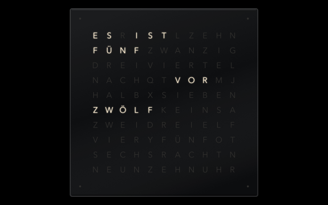

# Wortuhr – Bildschirmschoner für macOS

Wortuhr im 11×10-Raster mit vier Minutenpunkten. Zeitansage Hochdeutsch
(„viertel nach drei“) oder Süddeutsch („viertel vier“, „dreiviertel vier“),
Farben, Schrift, Größe und Einbrennschutz im Optionen-Dialog einstellbar.

Getestet unter macOS 27 auf Apple Silicon; gebaut wird für Apple Silicon und Intel (ab macOS 13).

## Bauen und installieren

    ./build.sh --system

Braucht Xcode (oder die Command Line Tools). Das Skript baut für Apple Silicon und Intel,
erzeugt das Vorschaubild, signiert ad hoc und installiert nach `/Library/Screen Savers`
(fragt nach dem Administrator-Passwort). Danach in den Systemeinstellungen die Kachel
„Wortuhr“ einmal anklicken.

Nur aus `/Library/Screen Savers` zeigen die Systemeinstellungen das eigene Vorschaubild;
`./build.sh` ohne Option installiert nach `~/Library/Screen Savers` (dann mit Standard-Strudel).

Mit `--arm-only` wird nur für Apple Silicon gebaut – schneller, reicht für den eigenen Mac
(z. B. `./build.sh --system --arm-only`). Zum Weitergeben ohne die Option bauen.

## Wenn etwas nicht geht

    ./diag.sh

schreibt Systemprotokoll (letzte 20 Minuten) und Absturzberichte nach `diag.log`.

## Eigenheiten von macOS 26+, die der Code abfängt

- Der Bildschirmschoner läuft hinter dem Anmeldefenster weiter → bei Eingabe ausblenden.
- Das Anmeldefenster verschwindet nach 30 s ohne Eingabe wieder → dann Uhr wieder einblenden.
- Die Vorschau in den Systemeinstellungen meldet `isPreview = false` → Eingabeerkennung nur beim echten
  Bildschirmschoner: nach `didstart` oder wenn der Bildschirm gesperrt ist (`CGSSessionScreenIsLocked`).
  Die Größe taugt nicht als Merkmal – die Vorschau ist intern ebenfalls bildschirmgroß.
- `didstart` ist unzuverlässig: kommt manchmal gar nicht, manchmal bevor macOS eine zweite Ansicht anlegt
  → Zustand gilt prozessweit, zusätzlich Prüfung auf gesperrten Bildschirm.
- Hinter dem Anmeldefenster bleiben `animateOneFrame` bzw. die Animation aus → eigener Takt (`DispatchSourceTimer`), `stopAnimation` hält die Uhr nicht an.
- `legacyScreenSaver` beendet sich nicht → `exit(0)` nach `willstop`.
- NSColorPanel ist im Bildschirmschoner-Prozess unzuverlässig → Farben als Auswahllisten.

## Prototyp

`prototype/index.html` im Browser öffnen: dieselbe Uhr zum Ausprobieren von Zeitansage,
Farben, Schrift und Größe, mit Zeitraffer. Die Einstellungen lassen sich als JSON kopieren.

## Aufbau

- `Sources/ClockFace.swift` – Buchstabenraster und Zeitlogik
- `Sources/Settings.swift` – Einstellungen, Voreinstellungen, Speichern (ScreenSaverDefaults)
- `Sources/WortuhrView.swift` – Darstellung mit Core Animation (ein Glyphen-Layer pro Buchstabe)
- `Sources/ConfigController.swift` – Optionen-Dialog
- `Sources/Log.swift` – Diagnose-Ausgaben (`./diag.sh` sammelt sie)
- `Tools/main.swift` – erzeugt das Vorschaubild für die Systemeinstellungen (11:55)

## Lizenz

MIT – siehe [LICENSE](LICENSE).
